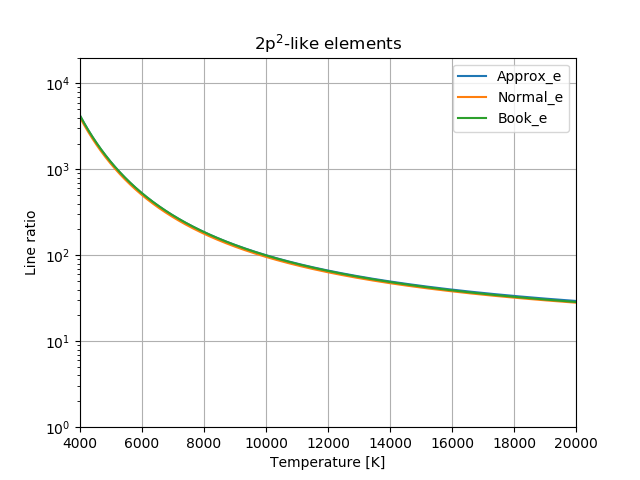
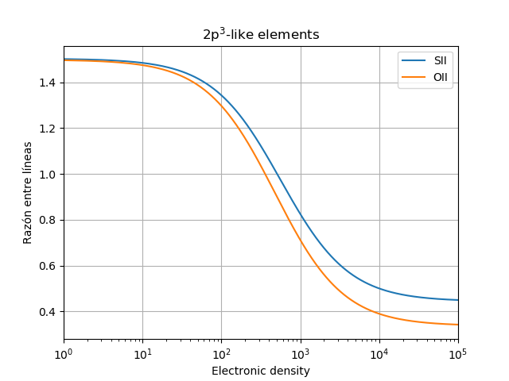
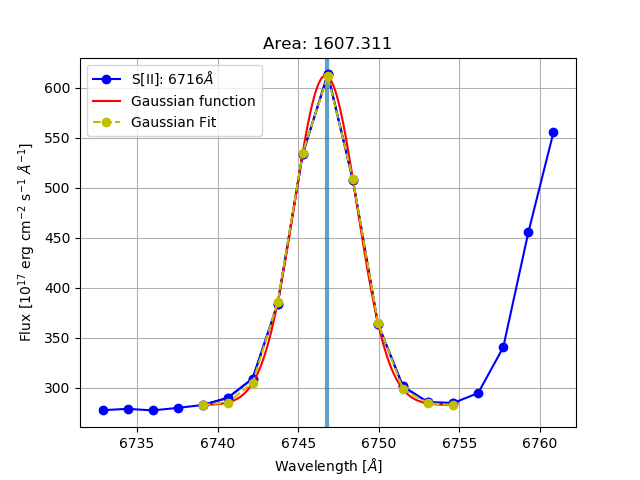

# AGN
Codes to calculate Temperature [K] and Density [particle/cm^3] from the lines ratio of certain ions in the narrow line region of a given AGN. 

The python script takes the values for Einstein Coefficients, collision strength, and statistical weights from [Osterbrock, 2006](http://adsabs.harvard.edu/abs/2006agna.book.....O).
The script is based on the one written by de Robertis, Dufour, & Hunt (fivel.f). The paper explaining the fivel program can be found at [Journal of the Royal Astronomical Society of Canada](http://adsabs.harvard.edu/abs/1987JRASC..81..195D).

---
## Lines_ratio

### Usage and calling sequence

If the program is called as a python module, the calling proccedure is like:
```python
import lines_ratio as lr
  
name = 'data/spec-1070-52591-0072.fits' #Example of .fits data
T, Ne = lr.calculation(name=name)

print("  Temperature  {}\n  Density      {}".format(T,Ne))
```
Here the user will be ased for the ions to make the calculations if they are not specified. Avaliable ions are (O[III] or N[II]) and (S[II] or O[II]) (see Ions example below).  It returns T and Ne, the temperature and particle density in [K] and [particle/cm^3] respectively, of the narrow line region from an AGN.

---
There are two equations used to make the calculations, from -like ions and -like ions 


### Ions examples:

1. Equations for -like ions

   The equation for the ion O[III] is:  

     

   While the equation for the ion N[II] is:

     


2. Equations for -like ions

   The equation for the ion S[II] is:

     

   And for the O[II] ion is:

     


## Graphs

  




